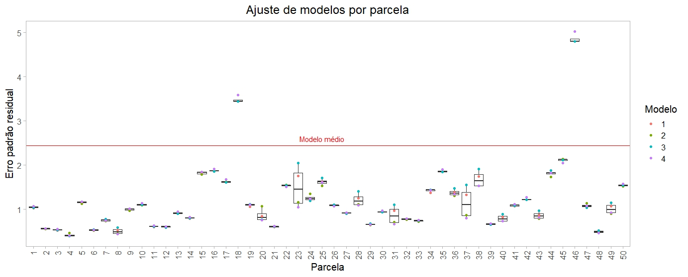

# Automatização de ajustes hipsométricos

## Objetivo
Esse script tem como objetivos Executar as seguintes análises:

1. Automatizar o ajuste de 4 modelos hipsométricos diferentes a nível de parcela.
2. Calcular o erro de cada equação ajustada.
3. Selecionar o melhor ajuste para cada parcela.
4. Estimar as alturas ausentes a partir das melhores equações por parcela.
5. Verificar se há ganho de precisão com o ajuste por parcela. 

O dataset [Medidas de DAP e Altura de árvores de 50 parcelas](https://github.com/fabiano-rp/ajustes-hisometricos-automaticos/blob/6b6b3616cbdcdf057dae80711e4dbbd50efdf90f/docs/dados.txt) foi obtido por meio de um inventário florestal e possui os seguintes atributos:

Parcela:
Número da parcela em que os dados foram coletados. Em cada parcela foi coletado todos os diâmetros a 1,3 m do solo e algumas alturas das árvores.

Árvore:
Corresponde ao número da árvore dentro de cada parcela, sempre iniciando de 1.

DAP:
Diâmetro da árvore à altura de 1,3 m acima do solo. Esta medida é dada em cm.

Ht:
Altura da árvore em metros.

## Informações Técnicas
Utilizou-se os seguintes pacotes:
```
library(ggplot2)
library(tidyr)
```
## Ferramentas e tecnologias:
<div align="center">


</div>

### Conclusão
**O ajuste por parcela promoveu ganhos de precisão?** 

*Maioria dos ajustes selecionados a nível de parcela apresentaram menor erro do que o ajuste feito para toda a base de dados*

<div align="center" style="display: inline_block">
    
</div>

<br>
<br>

**Essa automatização de ajuste de equações pode ser expandida?**

*Sim, este script pode ser utilizado para o ajuste e seleção de modelos para milhares de parcelas*


<br>
<br>

<div align="center"> 
Última Atualização: Fev/2023 <br> 
O que você achou? Se gostou, deixa uma ⭐ !!
Keep Coding!
</div>
<div align="center" style="display: inline_block"><br>
  
  <p><a href="https://giphy.com/">via GIPHY</a></p>
</div>
